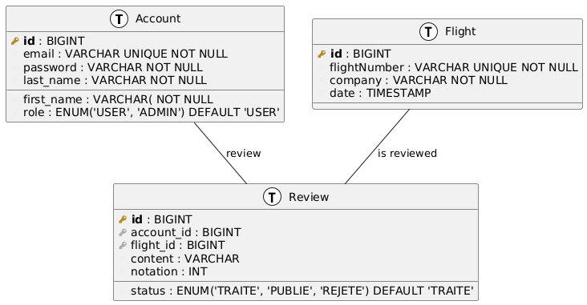

# Architecture du Projet:



L'architecture de ce projet a été pensée en amont, avec une structure modulaire permettant une implémentation progressive de ses différentes parties. Dès le départ, des aspects cruciaux comme la **gestion des droits** et l'**authentification** ont été intégrés, afin d'éviter une restructuration majeure du code ultérieurement.

---

## Technologies Clés

### Docker

**Docker** est au cœur de ce projet. Il est essentiel pour contrôler l'environnement de développement et assurer la portabilité de l'application. Cette approche permet de simplifier le développement et de faciliter le déploiement sur différents environnements, tout en minimisant les problèmes liés aux spécificités de chacun.

Sa composition est :

- PostgreSQL database (la base de données, qui est donc gérée dans docker)
- Spring Boot backend (le back-end)
- Angular frontend (le front-end, utilisant Nginx)

### Base de Données

Nous utilisons  **PostgreSQL** , une base de données moderne et particulièrement bien adaptée à une intégration avec Docker.

### Back-end

Le choix des technologies back-end a été guidé par la robustesse, la sécurité et la facilité de développement :

* **JWT (JSON Web Tokens)** : Utilisé pour créer des tokens de connexion, gérant ainsi les sessions utilisateur et permettant une gestion efficace des rôles.
* **JPA (Hibernate)** : Simplifie grandement la manipulation des données, réduisant le besoin d'écrire des requêtes SQL complexes manuellement.
* **Lombok** : Génère automatiquement les *getters* et *setters* des classes, améliorant la clarté et l'efficacité du code.
* **BCrypt** : Un encodeur puissant pour sécuriser les mots de passe des utilisateurs.

### Front-end

Pour le front-end, l'accent a été mis sur la rapidité de développement et la cohérence visuelle :

* **Angular Material** : Une bibliothèque de composants qui nous permet d'éviter de styliser (CSS) chaque composant individuellement, assurant ainsi une cohérence esthétique à travers toute l'application.
* **Material Icons** : Une bibliothèque d'icônes qui rend l'interface utilisateur plus dynamique et vivante.

---

## Utilisation de l'Intelligence Artificielle (IA)

L'IA a été un outil précieux dans certaines phases du projet, mais son rôle a été bien défini :

* **Non utilisée pour l'architecture ou la base de données** : L'IA n'a pas été employée pour concevoir l'architecture générale du projet, ni pour la création des entités ou la manipulation de la base de données. Ces aspects ont été développés manuellement.
* **Génération de services** : L'IA a été utilisée pour générer les services, en fournissant des listes d'actions utiles. Il s'agit principalement de code dont le nom de la fonction est auto-explicatif.
* **Implémentation de JWT** : L'IA a aidé à la mise en place du module JWT, en générant une utilisation basique de celui-ci.
* **Développement Front-end** : C'est dans ce domaine que l'IA a été la plus sollicitée. Étant donné mes compétences limitées en design, l'IA a prouvé son efficacité pour obtenir un rendu visuel attrayant rapidement, privilégiant ainsi l'efficacité.

---

## Sécurité

La sécurité est une préoccupation majeure. L'application s'appuie sur **JWT** pour gérer les tokens de connexion des comptes. Cette solution est particulièrement bien adaptée aux frameworks back-end et front-end utilisés, assurant une gestion sécurisée de la connectivité.

Et comme vu précédemment, on utilise aussi **BCrypt** pour ne pas stocker les mots de passe ne clair.


Idées d'amélioration

Utilisation d'API

# Lancer l'application

Bien qu'il soit possible de lancer l'application dans son environement personnel, il est recommandé comme vu plus haut d'utiliser Docker.

### lancer toute l'application :

```
docker-compose up --build
```

### Voir les logs :

```
Pour tout :
docker-compose logs -f

Par module :
docker-compose logs -f backend
docker-compose logs -f frontend
docker-compose logs -f postgres
```

### Stop :

```
docker-compose down
```

### Stop + Détruire volumes :

```
docker-compose down -v
```

### Points d'accès :

* **Frontend (Angular):** [http://localhost:4200](http://localhost:4200)
* **Backend API:** http://localhost:8080/api
* **PostgreSQL:** localhost:5432 (username: username, password: password)
